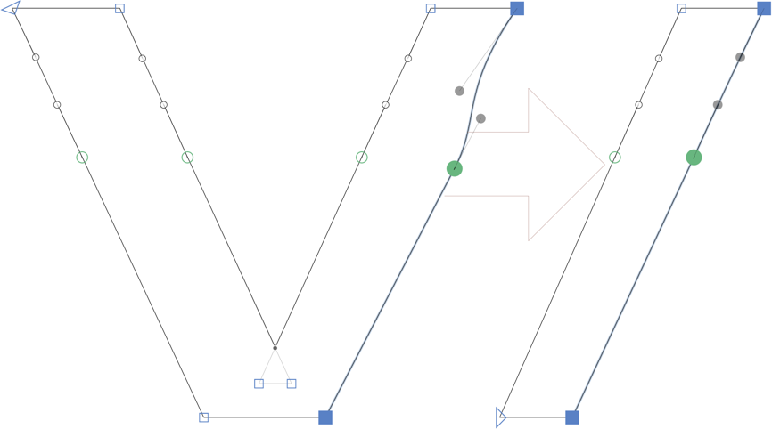

# LineUp

Glyphs.app filter for lining up nodes and anchors in your point selection

This is a plug-in for the [Glyphs font editor](https://glyphsapp.com/). It lines up nodes, handles and anchors in your point selection between the outermost points selected.

### Installation

1. In *Window > Plugin Manager,* look for *Line Up* and click *Install.*
2. Restart Glyphs

### Usage Instructions

1. Open a glyph in Edit View, and select three or more nodes.
2. Choose *Filter > Line Up Selection* (de: *Punkte auffädeln,* es: *Formar línea,* pt: *Formar linha,* jp: 直︀線︀化︀, ko: 직선화, zh: 📐选中点直线对齐)

### Requirements

The plugin needs Glyphs 3 or higher, running on OS X 10.11 or later.

### License

Copyright 2022 Rainer Erich Scheichelbauer (@mekkablue).
Based on sample code by Georg Seifert (@schriftgestalt).

Licensed under the Apache License, Version 2.0 (the "License");
you may not use this file except in compliance with the License.
You may obtain a copy of the License at

http://www.apache.org/licenses/LICENSE-2.0

See the License file included in this repository for further details.
